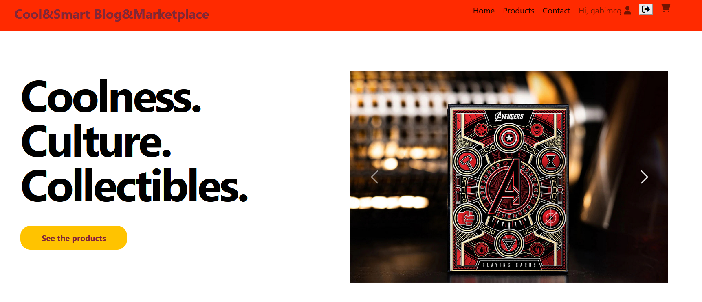
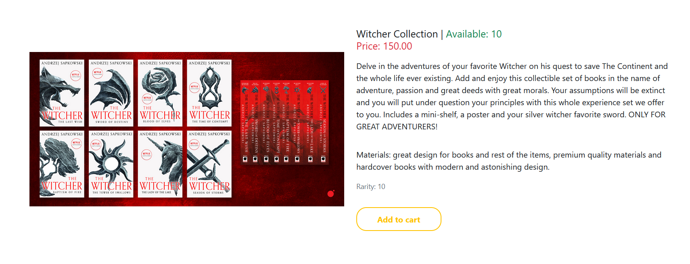

**Cool&Smart Blog&Marketplace**

Cool&Smart Blog&Marketplace is a web application/online shop with cool and collectible stuff for all ages, developed using python along with Django framework.
  
    Description
Cool&Smart Blog&Marketplace is a cool online web-place where users can find their most desirable and cool items.

   

    Download and Install

1. Install Pycharm Community Edition:		
    https://www.jetbrains.com/pycharm/download/
2. Install Python:						
    https://www.python.org/downloads/
3. Clone the repository locally:\
    git clone https://github.com/gmcg95/CoolandSmart_marketplace.git
4. Navigate to the project directory:\
    cd path\repository 
5. Install dependencies:\
    pip install -r requirements.txt 
6. Set up the database:\
    python manage.py migrate 
7. Create a superuser (admin):\
    python manage.py createsuperuser 
8. Run the development server:\
    python manage.py runserver

⇒ starting with "4.", the prompts needs to be executed in the terminal (Pycharm/Command Prompt).   
  *also "3." should be executed in the Command Prompt after navigating (cd) in the desired local path.

    Usage

1. Access the marketplace:\
    Open your web browser and navigate (or click the link from terminal after **runserver**) to http://localhost:8000 (http://127.0.0.1:8000/)
2. Login as admin:\
    Use the superuser credentials you created earlier to access the admin dashboard (http://localhost:8000/admin) and manage the marketplace. 
3. Explore and use the marketplace:\
    Browse through the marketplace, add/remove products, manage users, etc.
4. Note that to add/delete products to/from cart and sent orders you need to create first a user and to be logged.

